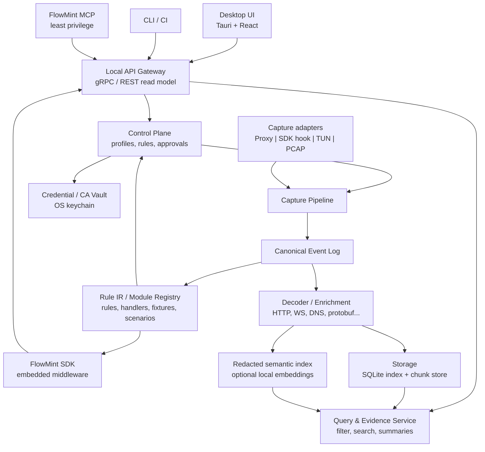
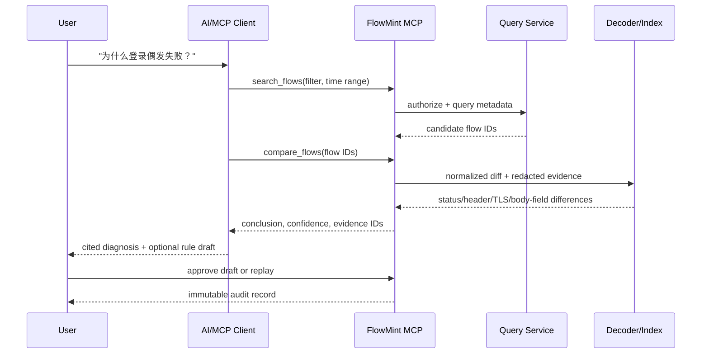

# FlowMint（流铸）面向开发者的网络行为分析与开发平台设计文档

**状态：** 架构基线 / 可实施设计  
**版本：** 0.3  
**日期：** 2026-07-18  
**目标：** 对齐 Fiddler / Charles 等主流抓包分析工具的核心功能集合（会话捕获、HTTPS 解密、断点改包、重放、规则），并把“流量观察 → 规则验证 → SDK 开发 → 运行证据回流”建设为一条**让开发者上手快、分析效率高、分析完即可低成本接入自身开发**的安全、可演进闭环。AI 与 MCP 作为提升分析与规则生成效率的加速能力，服务于这条开发者主线，而非平台的首要卖点。

## 1. 结论与决策

建议新项目采用 **Rust 网络核心 + TypeScript/React/Tauri 桌面端 + 版本化 gRPC/Protobuf API + MCP Server** 的组合，而不是沿用传统抓包库把 Go/C ABI 直接作为未来 SDK 公共基础的做法。

**设计北极星（优先级从高到低）：**

1. **使用方便：** 开发者能快速上手，从安装、抓包到看懂一条流量所需的认知与操作成本尽可能低。
2. **分析效率高：** 在大规模会话下快速定位、比较、解码和验证网络行为；所有工具（含 AI）都以缩短“从现象到结论”的时间为目标。
3. **分析完接入开发简单：** 已验证的网络行为可一键铸造成带 Rule、代码处理器、fixture、测试与权限清单的 Module，低成本接入开发者自己的应用与 CI。

AI/MCP、跨端一致的 Rule IR、可审计治理都是达成以上三点的**手段**，而不是独立目标。

这样选择的原因如下：

- 抓包工具、规则引擎、SDK 与 CI 不应各自实现网络逻辑；它们必须共同执行同一份版本化 Rule IR，才能保证“在工具里验证成功”的逻辑稳定、低成本地进入开发者的代码与运行时——这是“分析完接入开发简单”的技术前提。
- 所有采集来源必须归一到一个不可变、可审计的“网络事件模型”。HTTP 代理、系统驱动、TUN、SDK 插桩和导入 PCAP 只应是不同的 `CaptureAdapter`，开发者面对的分析与检索体验因此保持一致。
- 网络中间件处理的是不可信字节流、TLS 私钥、驱动权限与高并发连接。Rust 适合承载高性能且内存安全的核心；桌面交互和复杂表格/编辑器适合 Web 技术，二者共同支撑大规模会话下的分析效率。
- 传统回调式抓包库（以 Go/C 实现、跨平台动态库 + 回调 API）强项是功能广、跨平台；但 `uintptr`、消息 ID、回调地址等 C ABI 设计不适合作为长期、多语言、可自动化平台的主契约。
- AI 不应被直接授予“修改线上流量、导出敏感内容、安装根证书、启用系统驱动”的权力。作为分析加速器，AI 接口必须默认只读、数据最小化、可追溯、通过显式审批升级。

**产品名称：** `FlowMint`，中文名 **流铸**。名称含义是把已观察和验证的网络流量（Flow）铸造成可复用、可测试、可部署的软件网络逻辑（Mint）。

**产品线：** `FlowMint Studio`（桌面分析与规则开发）、`FlowMint Engine`（本地网络引擎）、`FlowMint SDK`（多语言运行时）、`FlowMint Modules`（可发布网络逻辑模块）、`FlowMint MCP`（AI 接口）、`FlowMint CLI`（CI/自动化）。

## 2. 调研范围、事实来源与边界

本设计以主流抓包/HTTP 调试工具的公开、通用能力作为功能基线：

| 参照 | 通用能力（业界共识） | 设计使用方式 |
|---|---|---|
| Fiddler（Classic/Everywhere） | 显式代理抓包、HTTPS 解密与证书安装、会话列表、断点改包（AutoResponder/Composer）、请求重放、导出 HAR。 | 桌面端功能对齐基线。 |
| Charles Proxy | 会话检查、SSL Proxying、Map/Rewrite/Breakpoints、Repeat、带宽/节流模拟。 | 桌面端功能对齐基线。 |
| mitmproxy | 可编程拦截（addon/脚本）、流量改写、可脚本化自动化。 | 可编程改写与 SDK 能力参照。 |
| HAR 规范 | HTTP Archive 交换格式。 | 导入/导出互操作。 |

### 2.1 本项目不承诺的误导性能力

- **“任何 HTTPS/HTTP3 流量均可自动解密”并不成立。** TLS 内容可见性依赖显式代理、用户信任本地 CA、应用内 SDK 提供明文事件或合法的会话密钥；证书锁定、ECH、QUIC 与系统策略会限制可见性。
- **“所有平台都能按进程透明捕获”也不成立。** Windows、Linux、macOS、Android、iOS 对驱动、TUN/VPN、签名、权限和商店策略的约束不同。
- 产品仅面向用户有权观测的系统和流量；不得实现或宣传绕过证书锁定、访问控制、系统安全机制或未授权截获。

## 3. 功能对齐矩阵

“兼容”指从用户与 SDK 开发者角度完成同等业务能力，不表示复制原 API、二进制格式或内部实现。

| 领域 | 主流抓包工具（Fiddler/Charles 等）通用能力 | FlowMint 目标 | 验收级别 |
|---|---|---|---|
| 引擎生命周期 | 创建、启动、停止、端口、错误查询 | Capture Profile、daemon 生命周期、健康状态、诊断 | P0 |
| HTTP/HTTPS | 请求/响应头、Cookie、Body、状态、URL 修改；MITM；HTTP 客户端 | HTTP/1.1、CONNECT、TLS MITM、请求/响应编辑、重放、HAR | P0 |
| WebSocket | 收发消息、改包、主动发包、关闭 | 帧时间线、文本/二进制/Hex、编辑、注入、关闭 | P0 |
| TCP/TLS-TCP | 数据获取/修改、目标重定向、单连接代理、收发、关闭 | 双向流、会话控制、受限改写、主动发送、协议插件 | P1 |
| UDP | 数据获取/修改、向客户端/服务端发包 | 数据报时间线、五元组归并、受限改写、主动发送 | P1 |
| 流量重定向 | HTTP/HTTPS/WS/WSS/TCP/TLS-TCP 重定向 | 声明式 route/rewrite 规则与审计 | P0/P1 |
| 上游代理 | 全局/连接级 HTTP/HTTPS/SOCKS5，认证与规则 | Profile 级与 flow 级上游代理、凭据安全存储 | P0 |
| DNS/出口 | DNS、DoH、出口 IP、MustTcp | DNS 策略、DoH/DoT、路由策略、TCP 强制规则 | P1 |
| TLS | CA 生成、导入 X509/P12、导出、客户端认证、指纹 | CA 生命周期、证书仓、TLS Policy、JA3/HTTP2 指纹观察与测试 | P0/P1 |
| 压缩/数据工具 | gzip/deflate/zlib/br/zstd、Protobuf、图片转换 | 解码器注册表；JSON/Protobuf/gRPC/GraphQL 优先 | P0/P1 |
| 系统捕获 | Windows NFAPI/Proxifier/WinDivert TUN；进程名/PID 过滤 | 平台适配器；Windows 先行，其他系统按能力降级 | P1/P2 |
| 脚本 | Go 脚本和日志回调 | Wasm 插件 + 声明式规则；不允许插件直接接触宿主私钥 | P1 |
| 桌面分析 | 列表、筛选、详情、断点、改包、批量重放、会话归档 | 高性能会话工作台、版本化归档、导入/导出 | P0 |
| 工具箱 | HTTP 调试、编码/密码学、证书、代码生成、diff、主题 | 请求构造器、编码、证书操作、代码生成、diff；密码学仅离线本地工具 | P1 |
| AI/MCP | 本地可选 MCP，health/ops/events/invoke | 受控 MCP + 查询 API + 语义索引 + 审批工作流 | P0 |

### 3.1 现有 API 的迁移原则

传统回调式抓包库常见的“MessageId + 同步回调中读写”模型，在新平台中替换为：

```text
旧：callback(messageId) -> GetRequestBody(messageId) -> SetRequestData(messageId)
新：FlowEvent(immutable) -> DecisionRequest(revision) -> MutationPatch(expected_revision)
```

收益：避免竞态与悬挂指针；支持多消费者；每次改写可审计、可回滚；SDK 不需要管理跨语言内存释放函数。

### 3.2 产品核心闭环：从抓包到可部署模块

FlowMint 的首要价值不是单独提供抓包或 SDK，而是让开发者把**已验证的网络行为**安全地转化为自己的软件逻辑。完整闭环如下：

```text
Capture（捕获证据）
  -> Rule（可视化创建、AI 辅助生成、离线验证）
  -> Module（规则、代码处理器、fixture、测试、元数据）
  -> SDK / Engine（应用内或代理运行）
  -> Runtime Evidence（审计与脱敏运行证据回流 Studio）
```

所有对第三方系统的测试、代理或改写均必须在开发者拥有明确授权的应用、设备、账号与环境中执行。FlowMint 不将绕过证书锁定、访问控制或未授权篡改作为功能目标。

| 一等对象 | 定义 | 使用位置 |
|---|---|---|
| `Capture` | 原始或脱敏后的流量证据集合，以及采集配置与解码证据。 | Studio、CLI、AI 检索、fixture 来源。 |
| `Rule` | 版本化、可验证、可解释的声明式匹配与动作。 | Studio、Engine、SDK、CI。 |
| `Module` | 可发布的网络逻辑包，可包含 Rule、编程式处理器、fixture、测试和权限声明。 | SDK 集成、团队共享、发布。 |
| `Scenario` | 一组输入 Capture/变量/预期结果，用于回放和回归。 | Studio、CLI、CI。 |
| `Runtime Evidence` | SDK/Engine 命中 Module 后生成的脱敏审计与结果证据。 | Studio 排错、AI 分析、回归。 |

### 3.3 Rule IR：GUI、SDK 与 CI 的共同契约

Rule IR 是本项目最重要的公共契约。GUI 的表单、AI 的规则草案、多语言 SDK 的 middleware、CLI 回放和服务器端规则执行均编译/映射到同一 Rule IR。Rule 由 `match`、`actions`、`limits`、`scope`、`fallback`、`audit` 六部分构成。

```yaml
id: rewrite-profile-for-development
name: Rewrite profile response for development
version: 1.0.0
match:
  protocol: http
  host: api.example.test
  method: GET
  path: /v1/profile
  response:
    content_type: application/json
actions:
  - json_patch:
      target: response.body
      operations:
        - op: replace
          path: /features/experimental
          value: true
limits:
  max_body_bytes: 1048576
  timeout_ms: 20
fallback: pass_through
scope:
  environment: development
  allow_hosts: [api.example.test]
audit_label: development-feature-test
```

规则动作分为 `observe`、`redact`、`rewrite`、`respond`、`route`、`shape`、`breakpoint` 与 `record`。对于任意 TCP/UDP 字节流，只有在协议插件已声明消息边界、长度/校验和维护方式及错误策略时才允许语义改写；裸字节变换必须显式标注风险。

## 4. 用户、部署形态与范围

| 用户 | 首要目标 | 推荐入口 |
|---|---|---|
| 应用开发者 | 调试 API、模拟异常、重放请求 | Desktop、CLI、HTTP SDK |
| 测试/QA | 录制、回归、故障注入、报告 | CLI、规则包、CI |
| 协议研发 | TCP/UDP/自定义协议的帧与字段分析 | Desktop、插件 SDK、AI 分析助手 |
| 安全/运维团队 | 在授权范围内排查网络问题 | 受管 daemon、RBAC、审计导出 |
| AI Agent | 检索、总结、差异分析、提出假设 | MCP（默认只读） |

支持三种部署：

1. **Desktop 本机模式（P0）**：Tauri UI 管理 localhost daemon。默认仅监听 loopback。
2. **Headless/CI 模式（P0）**：CLI 启动代理或读取归档，输出 JSON/HTML/JUnit。
3. **受管 Agent 模式（P2）**：远程机器运行 agent，经 mTLS 连受控控制面；默认不上传正文。

## 5. 总体架构



### 5.1 进程边界

- `flowmint-engine`：唯一持有监听 socket、TUN/驱动句柄、MITM CA 私钥与 payload 写权限的进程；执行 Rule IR。
- `flowmint-studio`：不直接持有 CA 私钥；通过本地认证的 IPC 调 Engine，并负责规则开发、回放验证、SDK 模块导出与运行证据查看。
- `flowmint-mcp`：可嵌入 Engine 或以 sidecar 运行，令牌最小权限、只监听 loopback。
- `flowmint-plugin-host`：独立 Wasm runtime；发生崩溃、超时或越权时不拖垮采集核心。

## 6. 规范化事件模型

所有协议、采集方式和 SDK 输出均写成 append-only 事件。稳定 ID 使用 ULID/UUIDv7，时间同时保存 UTC wall-clock 与 monotonic offset。

```protobuf
message NetworkEvent {
  string event_id = 1;
  string capture_id = 2;
  string flow_id = 3;
  string parent_flow_id = 4;
  uint64 sequence = 5;
  google.protobuf.Timestamp observed_at = 6;
  Direction direction = 7;
  EventKind kind = 8;
  Endpoint source = 9;
  Endpoint destination = 10;
  ProtocolStack protocol_stack = 11;
  PayloadRef payload = 12;       // hash, length, redaction state, storage locator
  map<string, Value> attributes = 13;
  DecodeStatus decode_status = 14;
  EvidenceRef evidence = 15;     // origin adapter, decoder/plugin version
}
```

最小事件类型：`FlowOpened`、`TlsHandshake`、`HttpRequestHeaders`、`HttpRequestBodyChunk`、`HttpResponseHeaders`、`HttpResponseBodyChunk`、`WebSocketFrame`、`TcpDataChunk`、`UdpDatagram`、`DnsMessage`、`FlowClosed`、`RuleDecision`、`MutationApplied`、`Diagnostic`。

### 6.1 Body 与存储策略

- 索引元数据存 SQLite；正文与二进制包采用分块文件（默认 1-4 MiB chunk）并以 SHA-256 校验。
- 事件只引用 `PayloadRef`，禁止在 UI/MCP 列表读取中自动携带完整 Body。
- 每个 Capture Profile 配置最大 body、最大会话数、保留期、磁盘配额、采样率和压缩策略。
- 归档格式命名为 `.fma`（FlowMint Archive）：manifest + SQLite + payload chunks + 规则快照。导入 HAR、PCAPNG 等外部格式时生成 `.fma`；第三方私有格式需先完成公开格式逆向/授权验证，不能假定可无损读取。

## 7. 采集、协议与平台设计

### 7.1 采集适配器

| Adapter | 场景 | 内容可见性 | 阶段 |
|---|---|---|---|
| Explicit HTTP proxy | 浏览器、桌面客户端、CI | HTTP 明文；HTTPS/WSS 在授权 MITM 后可见 | P0 |
| SOCKS5 proxy | 通用代理客户端 | L4 可见；应用协议依赖解密/解析 | P0 |
| In-process SDK hook | 自有应用 | 最高，可在加密前/解密后获得语义事件 | P1 |
| PCAP import/live capture | 取证与诊断 | L3/L4；TLS payload 通常不可读 | P1 |
| Windows redirect/TUN | 按进程或系统流量 | 取决于协议与 TLS 入口 | P1 |
| Linux TUN/eBPF | 服务与开发机诊断 | 取决于权限、内核和 TLS 入口 | P2 |
| macOS Network Extension | 企业/开发场景 | 平台能力允许的范围 | P2 |
| Android VPNService | 测试设备 | 可采集 IP 流；HTTPS 内容需合法解密或 SDK | P2 |
| iOS SDK | 自有应用 | URLSession/Network.framework 可观测部分 | P2 |

### 7.2 TLS 与隐私

1. 默认关闭 MITM，首次启用必须显示目标范围、CA 存储位置和风险提示。
2. 每个 profile 使用独立 CA；私钥存系统 Keychain/DPAPI/libsecret，导出须二次确认。
3. TLS policy 显式记录：SNI、ALPN、协议版本、cipher、证书链、是否解密、失败原因。
4. `insecureSkipVerify` 只能作为测试 profile 的显式选项，UI 和审计日志必须标红。
5. HTTP/3/QUIC 不纳入 P0 的 MITM 承诺。P1 先提供流量元数据与导入分析；内容解密仅在受支持的受控客户端/SDK 模式下实现。

### 7.3 TCP/UDP 改写约束

HTTP 有明确消息边界；任意 TCP 没有。TCP/UDP P1 默认只支持捕获、发送、阻断、重定向和由协议插件声明边界后的修改。裸字节替换必须具有最大长度、超时和明确风险提示，且不能宣称能自动保持自定义协议的校验和、帧长度或加密状态正确。

## 8. 规则、断点与插件

规则使用可验证的 YAML/JSON DSL，编译为 AST，再由 daemon 执行。规则必须声明作用域、优先级、上限和审计标签。

```yaml
id: mock-orders-for-staging
scope: profile:staging
when:
  protocol: http
  host: api.example.test
  path_prefix: /v1/orders
  method: POST
then:
  - redact: { request_headers: [authorization, cookie] }
  - delay: { milliseconds: 250 }
  - respond:
      status: 200
      headers: { content-type: application/json }
      body: '{"id":"mock-001","status":"accepted"}'
audit_label: qa-fault-injection
```

支持动作：`tag`、`redact`、`route`、`rewrite`、`respond`、`abort`、`delay`、`throttle`、`breakpoint`、`record`、`sample`。规则执行必须产生 `RuleDecision` 与 `MutationApplied` 事件，包含规则版本、前后 hash、操作者与结果。

插件以 **Wasm Component** 运行，权限声明包括 `decoder`、`enricher`、`rule_action`、`exporter`。不允许插件读取任意本地文件、网络、原始 CA 私钥或未授权 payload；所有 host call 必须按 capability token 授权。

## 9. 桌面工具信息架构

| 模块 | 关键界面/能力 | 优先级 |
|---|---|---|
| Capture Profiles | 代理端口、证书、适配器、DNS、上游、保存策略 | P0 |
| Session Explorer | 虚拟化列表、列配置、过滤、全文/字段搜索、颜色/注释 | P0 |
| Flow Inspector | Overview、Timeline、Request、Response、Frames、Hex、TLS、Rules、Evidence | P0 |
| Breakpoint Editor | 暂停、编辑 patch、放行/丢弃、超时自动动作 | P0 |
| Replay Lab | 单条/批量重放、变量、diff、结果汇总 | P0 |
| Rules Studio | DSL 表单/文本编辑、校验、测试、版本历史 | P1 |
| Protocol Lab | 解码器选择、字段树、Protobuf schema、TCP/UDP 流 | P1 |
| Certificate Center | CA 生命周期、信任状态、导出/移除、客户端证书 | P0 |
| Tools | HTTP composer、编码、diff、代码生成 | P1 |
| AI Workspace | 对话、证据引用、协议假设、生成规则草案、审批队列 | P0 |

前端推荐 **Tauri 2 + React + TypeScript + TanStack Table/Virtual + Monaco**。若团队经验集中在其它桌面技术栈（如 Wails/Vue、Electron），也可替换，但 daemon API 与事件模型不可依赖具体 UI 框架。

### 9.1 Module 开发工作流

Studio 必须把“生成 SDK 代码”做成主工作流而不是工具箱中的零散按钮：

1. 开发者在一个或一组 Flow 上定位 URL、Header、JSON/Protobuf 字段、WS 帧或协议字段。
2. Studio 或 AI 生成最小作用域的 Rule 草案，并显示历史命中范围和敏感字段风险。
3. 规则先在录制 Capture 上做离线回放，显示解压/解码、执行前后 diff、命中数、超时和 fallback。
4. 验证通过后导出 Module：Rule、语言代码处理器、脱敏 fixture、单元测试、版本与权限清单。
5. 开发者将 Module 接入 FlowMint SDK；SDK 产生 Runtime Evidence，并能导回 Studio 对照排错。

一个 Module 的最低发布结构如下：

```text
rewrite-profile-for-development/
  module.yaml                 # id、版本、scope、权限与 SDK 兼容范围
  rule.flowmint.yaml          # 声明式 Rule IR 源码
  handler.ts                  # 可选编程式处理器
  handler.test.ts             # 从 fixture 生成的回归测试
  fixtures/
    original-flow.fma
    expected-response.json
  README.md                    # 命中条件、风险、fallback、审计标签
```

## 10. AI 辅助分析（从属于开发者效率主线）

### 10.1 设计目标

AI 在 FlowMint 中是**服务于“分析效率高”和“接入开发简单”两条主线的加速器**，不是平台的核心定位，也不是“把所有原始包塞进模型”。它的职责是在受控范围内帮开发者更快地：定位异常、理解协议字段、比较会话、生成可审计的假设与规则草案，并将所有结论绑定回原始证据。开发者不用 AI 也应能通过 Studio 与 CLI 完成完整的抓包 → 分析 → 接入闭环；AI 只是把其中重复、繁琐的分析步骤变快。

### 10.2 四层 AI 接口

| 层 | 目的 | 典型调用 | 默认权限 |
|---|---|---|---|
| Catalog | 发现可用 Capture、schema、解码器和策略 | `list_captures`, `get_capabilities` | 只读 |
| Query | 精确检索元数据和脱敏后的 payload 片段 | `search_flows`, `get_flow_summary`, `get_payload_range` | 只读、配额 |
| Reason | 服务器侧统计、差异、聚类、字段推断 | `diff_flows`, `summarize_protocol`, `infer_schema` | 只读、可复现 |
| Act | 创建草案、请求重放、修改规则、启停引擎 | `draft_rule`, `replay_dry_run`, `request_approval` | 审批后执行 |

### 10.3 MCP 工具设计

MCP 使用 Streamable HTTP 或 stdio，两者均只绑定 `127.0.0.1`（远程受管模式另行使用 mTLS）。不要仅暴露一个泛化的 `invoke(op, json)`，因为它难以发现、难以授权和难以审计；应暴露强类型、细粒度工具。

| 工具 | 输入 | 输出 | 风险 |
|---|---|---|---|
| `flowmint_list_captures` | 时间/标签 | Capture 摘要 | 低 |
| `flowmint_search_flows` | 结构化 filter、limit、cursor | 元数据和最小证据 | 低 |
| `flowmint_get_flow` | flow id、view、include options | 脱敏流详情 | 低 |
| `flowmint_get_payload_range` | payload ref、offset、length、representation | 有上限的片段 | 中 |
| `flowmint_compare_flows` | flow ids、比较维度 | 结构化 diff + evidence ids | 低 |
| `flowmint_protocol_hypothesis` | flow ids、目标问题 | 字段/帧推断及置信度 | 低 |
| `flowmint_draft_rule` | 自然语言或 DSL、scope | 未启用的规则草案 | 中 |
| `flowmint_replay_dry_run` | flow/template、变量 | 请求计划，不发包 | 低 |
| `flowmint_request_action` | action、理由、影响范围 | approval id | 中 |
| `flowmint_execute_approved_action` | approval id | 审计结果 | 高 |

每个 AI 返回必须附带：`evidence_ids`、读取时间范围、脱敏策略版本、decoder 版本、置信度、未知项。禁止模型把推测描述为已观测事实。

### 10.4 数据最小化与防提示注入

- 网页内容、HTTP header、Body、二进制转文本结果都是不可信数据；绝不把其中的“指令”当作控制指令。
- 默认遮蔽 `Authorization`、Cookie、Set-Cookie、API key、JWT、邮箱、手机号等；支持组织正则/字典策略。
- AI 读取 Body 按片段、总字节数、会话数和时间窗限额执行；超过额度需用户确认。
- 检索索引默认本地生成、可完全关闭；外部模型调用前必须显示数据目的地、字段范围与脱敏预览。
- 任何可能联网、发包、改包、导出或改变证书/系统代理状态的 AI 动作都只生成审批请求，不能直接执行。

### 10.5 协议分析工作流



## 11. SDK 与 Module 运行时设计

SDK 的首要体验应接近 Web 框架的 middleware：开发者用少量类型安全代码声明匹配条件并改写**自己有权调试和控制的应用流量**，无需管理消息 ID、C 指针、分包、压缩、线程或回调生命周期。

SDK 分为三类：

1. **Control SDK（P0）**：基于 gRPC/REST，管理 Engine、查询会话、导入导出、管理 Rule/Module/Scenario。优先 TypeScript、Python、.NET、Java/Kotlin、Go。
2. **Embedded Rule SDK（P0）**：在应用内加载已验证的 Rule/Module，执行 HTTP/HTTPS/WS 逻辑并回传 Runtime Evidence。首发 TypeScript、.NET；后续 Java/Kotlin、Python、Go、Swift。
3. **Instrumentation SDK（P1）**：在自有应用的 HTTP 客户端/TLS 边界产生语义事件；Java/Kotlin 对接 OkHttp、.NET 对接 HttpClient、Node 对接 undici、Python 对接 httpx/aiohttp、Swift 对接 URLSession、Go 对接 RoundTripper。

TypeScript 的编程式 Module 形态示例：

```ts
import { FlowMint, http } from "@flowmint/sdk";

const engine = new FlowMint({ profile: "development" });

engine.http.use(
  http.match({
    host: "api.example.test",
    method: "GET",
    path: "/v1/profile",
  }),
  async (ctx) => {
    const profile = await ctx.response.json();
    profile.features.experimental = true;
    await ctx.response.json(profile);
  },
);
```

SDK 必须具备：连接失败降级、不阻塞业务请求、采样、脱敏、本地缓冲上限、断路器、版本协商、OpenTelemetry trace/span 关联、每个 Module 的执行时限与 `pass_through` fallback。Embedded SDK 不得默默上传请求正文，也不得在未授权 profile 中执行流量改写。

Studio 导出的代码不是无上下文片段，而是完整 Module 包：Rule 源码、目标语言 handler、脱敏 fixture、测试、作用域/权限清单、最低 SDK 版本和 README。所有 SDK 运行结果输出结构化 Runtime Evidence：`module_id`、`module_version`、`flow_id`、命中结果、动作、前后 hash、耗时、fallback 与错误原因。

对必须嵌入低层能力的环境，提供稳定的 C ABI 作为**薄适配层**，但以 Protobuf schema、Rule IR 和 Engine API 为主契约。C ABI 的所有分配/释放、字符编码、线程、回调生命周期和错误码必须有明确规范，禁止裸 `uintptr` 表达复杂对象。

## 12. 安全模型与合规

| 风险 | 控制措施 |
|---|---|
| 根 CA 私钥泄露 | OS 凭据库、profile 隔离、不可自动导出、旋转/删除、审计。 |
| 本地 API 被其他进程调用 | loopback + 每次启动随机 token + OS 用户绑定 IPC；远程模式 mTLS/RBAC。 |
| AI/插件越权 | capability token、明确 scopes、默认只读、审批、超时、不可抵赖审计。 |
| 敏感抓包落盘 | 默认脱敏、加密存储选项、保留期、配额、可验证删除。 |
| 规则导致业务中断 | dry-run、作用域预览、优先级、速率上限、回滚、breakpoint 超时策略。 |
| 驱动/系统代理权限 | 独立提权 helper、签名、最小权限、可恢复状态和卸载路径。 |
| 插件供应链 | 签名/哈希、权限清单、Wasm 隔离、版本锁定。 |

审计事件至少记录操作者（人/SDK/MCP client）、授权来源、profile、目标范围、输入 hash、输出 hash、规则/插件版本、时间、成功/失败原因。审计日志与网络 payload 分开保存。

## 13. 开发阶段、交付物与验收

| 阶段 | 预计范围 | 核心交付物 | 退出标准 |
|---|---|---|---|
| 0. 发现与 ADR | 2-3 周 | 协议/平台验证、事件 schema v1、威胁建模、许可证清单 | 评审通过，明确 P0 不含 HTTP/3 MITM 与全平台驱动。 |
| 1. Core MVP | 8-12 周 | Engine、HTTP/HTTPS CONNECT、CA、WS、事件日志、SQLite/chunk、CLI | 可稳定捕获/检索/导出 HAR；故障不泄露私钥或耗尽内存。 |
| 2. Studio + Rule IR | 6-8 周 | Tauri UI、Rule IR、列表、详情、断点、编辑、离线重放、结构化 diff | 100k 会话下列表可用；规则在录制流量上可复现且请求/响应修改可审计。 |
| 3. Modules + AI/MCP | 6-8 周 | Module 打包、fixture/test 生成、强类型 MCP、脱敏查询、规则草案、审批 | 规则可导出 TypeScript Module；默认只读，所有 Act 工具需审批与审计。 |
| 4. SDK/解码 | 8-12 周 | Control SDK、Embedded Rule SDK、HTTP instrumentation、Protobuf/gRPC/协议插件 | 至少 4 语言 control SDK、2 语言 embedded SDK、2 语言 instrumentation。 |
| 5. L4/L3 与平台 | 按平台拆分 | Windows adapter、PCAP、TCP/UDP、Linux/macOS/Android 适配 | 每个平台有能力矩阵和端到端测试，不能以“支持”概括未验证能力。 |

### 13.1 P0 验收测试

- 显式代理可捕获 HTTP/1.1、HTTPS CONNECT、WebSocket/WSS，并正确关联 tunnel 与子 flow。
- 在用户安装且信任测试 CA 的前提下，能显示、脱敏、修改并重放授权 HTTPS 请求；禁用 MITM 时不得显示正文。
- gzip、deflate、br、zstd 解码器对损坏输入不会崩溃，且有大小/时间限制。
- 每次断点编辑、规则改写、重放都生成可查询审计记录。
- 一个在 Studio 中验证通过的 HTTP JSON Rule，可导出为 TypeScript Module，并使用同一 fixture 在 SDK 中得到相同结构化结果。
- SDK 发生 Module 命中、超时、解析失败或 fallback 时，均产生脱敏 Runtime Evidence 并可在 Studio 中回放查看。
- 100k 元数据流与 10 GiB payload 归档中，列表/筛选不全量载入正文。
- MCP 无 token 或 token 无 scope 时，不能读取 payload、执行 replay、改写规则或启用引擎。
- AI 的“解释结果”可回跳至具体 `flow_id/event_id/payload_range`；无法证实的结论明确标为假设。

## 14. 代码库建议

```text
flowmint/
  crates/
    model/                 # event schema, rule AST, error taxonomy
    engine/                # lifecycle, control plane, authorization
    pipeline/              # backpressure, event fan-out, quotas
    proxy-http/            # HTTP/1.1, CONNECT, SOCKS5
    tls/                   # CA vault abstraction, MITM policy
    protocol-http/         # HTTP, WS, compression
    protocol-l4/           # TCP/UDP flow handling
    storage/               # index, chunk store, .fma
    rules/                 # compiler and executor
    api/                   # protobuf, gRPC service implementations
    mcp/                   # typed tools and approval boundary
    modules/               # module manifest, fixture, export, compatibility
    plugin-host/           # Wasm capability host
    adapters/              # pcap, Windows, TUN (feature-gated)
  apps/
    studio/                # Tauri + React
    cli/
  sdks/
    typescript/ python/ dotnet/ java/ kotlin/ go/ swift/
  proto/
  fixtures/                # pcap, HAR, malformed input, golden archives
  docs/
    adr/ threat-model/ api/ compatibility/
```

### 14.1 关键 ADR（应在编码前定稿）

1. Rust vs Go 核心，以及是否在 Windows adapter 复用现有受许可组件。
2. CA 私钥存储、导入导出和企业托管策略。
3. `.fma` 归档规范、加密与兼容策略；第三方私有格式仅作为外部导入器。
4. MCP 传输、token 签发、审批 UX 与审计保留期。
5. HTTP/2 与 HTTP/3/QUIC 的功能边界。
6. TUN/驱动平台支持顺序、签名、管理员权限与故障恢复。
7. 本地/云端 AI 的数据出站开关和组织策略。

## 15. 建议的首个迭代 Backlog

1. 定义 Protobuf `NetworkEvent`、`Flow`、`PayloadRef`、`Rule`、`Module`、`Scenario`、`Approval` schema v1，并生成 TypeScript/Rust 客户端。
2. 建立 FlowMint Engine skeleton：profile、端口管理、结构化日志、健康检查、随机本地 token。
3. 实现 HTTP proxy + CONNECT，先记录未解密隧道元数据；再在显式 profile 中接入测试 CA MITM。
4. 实现 append-only event writer、SQLite index、chunk store、配额与自动清理。
5. 实现 CLI：`capture start`、`flow search`、`export har`、`archive inspect`、`scenario run`。
6. 实现最小 FlowMint Studio：Capture profile、虚拟会话列表、HTTP/WS 详情、过滤、证书状态与 JSON Rule 编辑器。
7. 实现 Rule 离线回放、前后结构化 diff、fixture 固化，以及向 TypeScript Module 与单元测试的导出。
8. 实现只读 MCP：`flowmint_list_captures`、`flowmint_search_flows`、`flowmint_get_flow`、`flowmint_compare_flows`，全部强制脱敏和返回 evidence ID。
9. 引入模糊测试：HTTP parser、chunk archive、压缩解码、Rule parser、Module manifest 和 MCP 输入。

## 16. 许可证与二次开发处理

FlowMint 是独立实现，采用自有许可证。若复用任何第三方源码/二进制/组件，必须遵守其各自许可证，并逐项维护 `THIRD_PARTY_NOTICES`、SBOM 和版本锁定。

“对齐主流工具的功能”不应理解为不加分析地复刻任何第三方内部代码、动态库 ABI、驱动或私有记录格式。推荐路径是：以公开行为和用户工作流建立兼容测试集，必要时在遵守许可证与适用法律的前提下实现隔离适配器。

## 17. 需要立项人确认的产品决策

以下选择会显著改变成本和合规边界，应在 P0 开始前由产品/安全负责人确认：

| 决策 | 建议默认值 | 影响 |
|---|---|---|
| 是否首发 Windows 驱动捕获 | 否，先显式代理与 SDK | 可大幅降低首版提权/驱动签名风险。 |
| 是否允许云端 AI | 否，默认本地或关闭 | 决定数据合规、模型供应商与脱敏强度。 |
| 是否面向企业远程 agent | 否，P2 再做 | 引入身份、租户、mTLS、审计与运维面。 |
| 是否要求 HTTP/3 内容解密 | 不进入 P0/P1 承诺 | 需要额外的 QUIC/TLS 设计与严格范围控制。 |

---

**最终定位：** FlowMint（流铸）不是单纯的“抓包软件”，而是一个**以开发者体验为中心**、把网络流量证据铸造成可验证、可测试、可部署 SDK 网络逻辑模块的开发平台。它的成败由三件事决定：开发者是否**上手方便**、大规模会话下是否**分析高效**、验证完是否能**低成本接入自身开发**。落到首版即：HTTP/HTTPS/WS 的可靠闭环、Rule IR 的跨端一致性、离线回放与 Module 导出、数据治理。AI/MCP 作为分析与规则生成的加速器服务于以上目标；TCP/UDP、驱动捕获和更广的平台支持则在这个核心稳定后逐步扩展。
